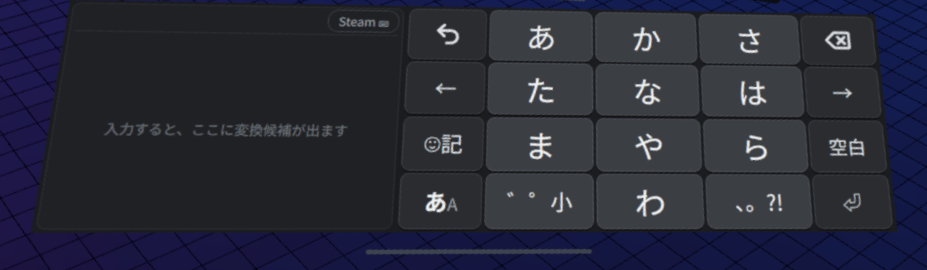
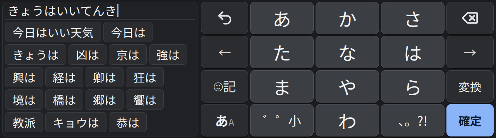
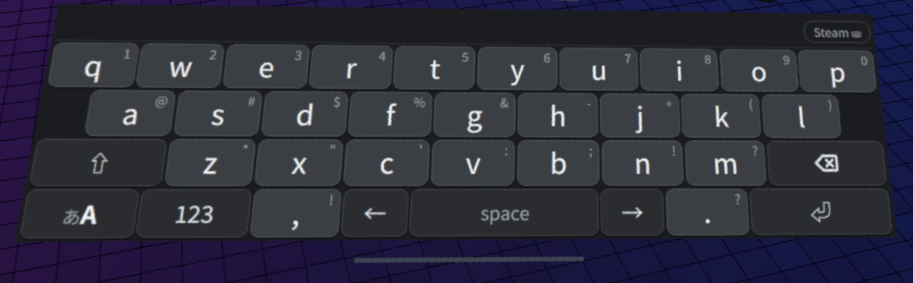

# frame-jp-keyboard

Steam Frame の VR キーボードに、スマホでおなじみの**12 キーのフリック入力**、**かな漢字変換**、**英単語の候補つきの QWERTY** を重ねて表示する。Steam のファイルは書き換えない。Steam クライアントの中（SharedJSContext）に Chrome DevTools Protocol で JS を差し込んで動かす。

- 変換には、本体に入っている anthy（libanthy）を差し込み役（Python）から直接使う。IBus は使わないので、純正キーボードの状態には触らない。学習データ（`~/.anthy`）は純正キーボードと共有する。
- 自作キーボードで足りないときは、いつでも純正キーボードに切り替えられる。

> **非公式のツールです。** Valve とは関係ありません。Steam の非公開の仕組みに頼っているので、Steam の更新で動かなくなることがあります。自己責任で使ってください（下の「注意」を読んでください）。

## スクリーンショット

日本語（左に変換候補、右に 12 キーのフリック）。ヘッドセットの中で撮影:



入力中。打つたびに、文全体の変換から先頭の文節の候補までが左に並ぶ:



英語（QWERTY。キー右上の文字は上フリックで入る）:



## 必要なもの

- 開発者モードを有効にした Steam Frame（設定 → システム → 開発者モードを有効化。開発者の項目でパスワードを設定）。開発者モードのときだけ、Steam が本体の中からだけ届くデバッグ用の口（`127.0.0.1:8080`）を開くので、それを使う。
- 本体に SSH などでファイルをコピーできること。
- sudo は要らない。

## インストール／アンインストール（Frame 本体）

リリースの `frame-jp-keyboard-<バージョン>.tar.gz` を本体にコピーして、本体の上で:

```sh
tar xzf frame-jp-keyboard-*.tar.gz
cd frame-jp-keyboard
./install.sh              # 入れる・更新する（サービスを再起動して、その場で差し直す）
./install.sh --uninstall  # 外す（そのあと Steam を再起動すると完全に純正に戻る）
```

- 置き場所: `~/.local/share/frame-jp-keyboard/`（bundle.js と差し込み役、更新用の frame-update.sh）、`~/.config/systemd/user/frame-jp-keyboard.service`、`~/.config/frame-jp-keyboard/install-args`（更新のときに使う）
- Steam が起動するたびに、サービスが自動で差し込む。

## 使い方

スマホのフリック入力や QWERTY と同じ感覚で使える。VR ならではのところだけ:

- **フリック**: キーの上でトリガーを引いたまま、レーザーを上下左右に振って離す。
- **変換**: 打つと左に候補が出るので、タップで選ぶ（後ろに文節が続くときは次の文節へ進み、最後の文節なら確定）。「空白」で次の候補、「⏎」で全部確定。選んだ候補は次から上に来る。
- **あA**: 日本語 ⇔ 英語。英語では、打っている単語がキーの上に出て、スペース・記号・⏎・候補のタップで確定する。
- **☺記**: 記号のページ。
- **純正キーボードに戻す**: あA を長押し（または「Steam ⌨」）。自作に戻すときは右上の「あ」。

## 更新

- **点**: 「Steam ⌨」のすぐ左にある小さな点（かなのページは左上の読みの行、英語・数字・記号のページは上の候補の行）。新しい版があると青く光る。
- **確かめる**: 点をタップすると、その場で GitHub の最新版を確かめる。
- **更新する**: 新しい版があれば「更新する／やめる」が出る。「更新する」で裏で入れ替わる（サービスが再起動するので、キーボードが一瞬消えることがある）。
- **自動の確認**: 起動時と 1 時間ごと（GitHub に聞くのは 1 日 1 回まで）。止めるなら `__fjk.settings.updateCheck = false`（点のタップはいつでも使える）。
- **記録**: うまくいかないときは `~/.cache/frame-jp-keyboard/update.log` を見る。

## 設定

Steam の CDP コンソール（SharedJSContext）で変えられる。値は Steam の localStorage に保存される。

```js
__fjk.settings.toggleInput = true;   // 同じキーの連打で あ→い→う…（既定はオフ）
__fjk.settings.flickThreshold = 24;  // フリックとみなす距離（px）
__fjk.settings.conversion = false;   // かな漢字変換を使わない（ひらがなを直接入力。差し直し後に有効）
__fjk.settings.liveDelayMs = 150;    // 打つ手を止めてから候補を出すまでの時間（ms、差し直し後に有効）
__fjk.settings.predictions = true;   // 予測（前に確定した言葉）も候補に出す（差し直し後に有効）
__fjk.settings.suggestions = true;   // 英語の QWERTY で単語の候補を出す
__fjk.settings.autoCapitalize = true; // 「. 」などのあとの最初の文字を自動で大文字にする
__fjk.settings.updateCheck = true;   // 起動時と 1 時間ごとに更新を自動で確かめる（点のタップには関係ない）
__fjk.setEnabled(true);              // 自作キーボードのオン／オフ
```

- `__fjk.settings` を直接変えた値は、次に `setEnabled` を呼んだときやモードを切り替えたときに保存される。
- `mode`（`'kana'` か `'qwerty'`）は、あA で切り替えると自動で保存される。

## うまく動かないとき

- **ログを見る**: `journalctl --user -u frame-jp-keyboard -f`。JS 側のログは `[fjk]` 付きで出る。
  - `libanthy loaded` と `conversion ready` … 変換が使える。
  - `conversion backend unavailable` / `libanthy unavailable` … 変換が使えないので、ひらがなをそのまま入力している（候補の欄に「変換なし」と出る）。
- **差し直す**: `python3 ~/.local/share/frame-jp-keyboard/frame_jp_keyboard_injector.py --once`。古いものを外してから新しいものを入れる。
- **その場で外す**: CDP コンソールで `__fjk.uninstall()`。ただしサービスが動いていると、数秒後にまた差し込まれる。止めるなら `systemctl --user stop frame-jp-keyboard` のあとに `__fjk.uninstall()`。完全に消すなら `./install.sh --uninstall` のあと Steam を再起動する。
- **調査用の記録**: CDP コンソールで `__fjk.debug.recorders(true)` のあと差し直すと、押した前後の入力・フリックの判定・Steam のキーボードへの呼び出しをログに出す（入力した文字は出さない。代わりに、実行中のアプリの ID やオーバーレイの名前は出る。`recorders(false)` で戻す）。既定はオフで、そのときは Steam の関数を一切包まない。
- 必要な Steam の中身が見つからないときは何もしないで、純正キーボードをそのまま残す（ログに `[fjk]` の警告が出る）。
- 開発用: CDP コンソールで `__fjk.debug.capture(true)` のあと `await __fjk.debug.type('かんじ')`、`await __fjk.debug.key('space')` などで、ヘッドセットなしに変換を試せる（確定した文字は入力先に送らず `output` にたまる）。`__fjk.debug.live()` で、いまの候補と時間（候補の計算 `lastMs`）が見られる。英語は `await __fjk.debug.english('helo')`、`await __fjk.debug.suggestion(1)`。画面の寸法は `__fjk.debug.measure('kana')`。
- 表示の位置がおかしいとき: 自作キーボードは純正キーボードのキーの枠にぴったり重ねる。その枠の位置が変なとき（ポップアップの大きさが変わったときなど）は、ポップアップ全体から下の 41 px（SteamVR の移動バーの場所）を除いた範囲に出す。

## 既知の問題

- **確定した日本語の一部が、まれに数字（1、2、3…）に化ける**ことがある（例: 3 文字目だけ「3」になる）。アプリに届ける仕組み自体は純正キーボードと同じで、原因は調査中。起きたら消して打ち直してください。
- **両手のレーザーをキーボードに向けていると、片方の手ではフリック中の案内が動かない**。SteamVR がその手の位置を離すまで送ってこないため。フリック自体はできて、離したときに入る文字が光る。片手だけ向ければ普通に出る。

## 注意

- **非公式**のツールです。Valve が作ったり、確認したり、サポートしたりしているものではありません。Steam および Steam Frame は、米国および／またはその他の国における Valve Corporation の商標および／または登録商標です。本プロジェクトは Valve と提携・承認・後援関係にありません。
- Steam の画面の中で自作の JavaScript を動かしますが、使うのは開発者モードのときだけ Valve 自身が開くデバッグ用の口（`127.0.0.1:8080`、Chrome DevTools Protocol）だけで、ディスク上の Steam のファイルは一切書き換えません。とはいえ、[Steam 利用規約](https://store.steampowered.com/subscriber_agreement/?l=japanese)には、これに当てはまり得る条項が 2 つあります。**2.G** は、Steam のソフトウェアやコンテンツのリバースエンジニアリング・複製・改変などを、「適用される法律に基づき別途許可される場合を除き」禁じています。**4.B** は、「Valve が別途許可しない限り」Steam の実行プロセスを改ざんしないこと、認められていないサードパーティソフトウェアで Steam のプロセスや UI とやり取り・制御しないことに同意する、としています。同じ仕組みの Decky Loader などは広く使われていますが、Valve が公式に認めたものではありません。**使うかどうかはご自身で判断してください。**
- 無保証です（LICENSE を参照）。**このソフトウェアの使用によって生じたいかなる損害（本体やアカウントに関するものを含む）についても、作者は一切の責任を負いません。**
- Steam の非公開の中身（SharedJSContext の内部オブジェクト、`VirtualKeyboardManager`、`SteamClient.OpenVR`）に頼っている。**Steam クライアントの更新で動かなくなることがある**。そのときは何もしないで純正キーボードに戻るように作ってあるので、ログを見て対応する。
- anthy の学習データは純正キーボード（ibus-anthy）と同じファイルを使う。anthy はロックファイルと差分ファイルで複数のプロセスからの書き込みを扱う作りなので、同時に使っても壊れない。
- 変換で選んだ候補は anthy が学習する（純正キーボードで変換したときと同じ）。候補を出すための変換（打つたびの自動変換）では学習しない。
- 予測は anthy の機能で、前に確定した言葉しか出ない（スマホの IME のような辞書ベースの予測は無い）。
- 更新を確かめるため、サービスが GitHub（`api.github.com`。更新するときは `github.com` とダウンロード先の `githubusercontent.com` も）に接続する。入力した文字などは送らない。入れるのは SHA256SUMS が付いていて、中身のハッシュが合うリリースだけ。
- 英単語の一覧は 12dicts 6.0.2（Alan Beale）から作った（`data/12dicts-6.0.2/`、作り直しは `npm run words`）。使ったリストは AGID（Kevin Atkinson）に依存しているのでパブリックドメインではなく、AGID・WordNet 1.6・UK Advanced Cryptics Dictionary の著作権表示を残す条件つき（再配布・改変は自由）。全文は `THIRD_PARTY_LICENSES.md`。

## 開発

```sh
npm install
npm test          # 単体テスト
npm run build     # dist/bundle.js を作る
npm run package   # テストとビルドのあと、dist/frame-jp-keyboard-<バージョン>.tar.gz と dist/SHA256SUMS を作る
```

- ビルドは PC（Node.js）で行う。本体では Python 3（aiohttp。SteamOS に入っている）で差し込み役が動くだけ。
- リリースには、アーカイブと一緒に `dist/SHA256SUMS` も付ける（無いと点からの更新で入れられない）。
- `vendor/frame-updater/` は、同じ作者の frame-updater リポジトリの写し。手で直さず、あちらの `sync.sh` で取り込み直す（`npm run package` が `MANIFEST.sha256` と照合する）。
- 開発中に Steam の中身を調べたメモやファイルは `research/`（Steam 内部の調査メモ置き場・非公開）に置く。`.gitignore` で除外していて**コミットしない**。

このプロジェクトは、設計・レビュー・検証・修正を作者（人間）が行い、AI アシスタント（Claude）と一緒に書いて、ユニットテストと実機の Steam Frame で確認しています。

## ライセンス

MIT。[LICENSE](LICENSE) を参照してください。注意: MIT ライセンスが対象とするのはこのプロジェクト自体のコードで、ビルドに埋め込んでいる英単語の一覧（`src/data/words-en.js`。12dicts / AGID 由来）は**対象外**です。こちらには別の著作権表示があります（[THIRD_PARTY_LICENSES.md](THIRD_PARTY_LICENSES.md)）。
